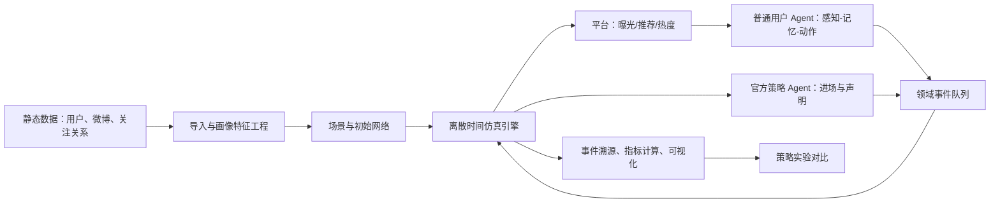

# 微博舆情多智能体社会模拟技术方案

> 版本：v0.1（初期 Demo 设计）  
> 目标：在可复现的微博传播仿真中回答两个问题：**官方应在何时进场**，以及**发布何种声明更有效**。

## 1. 建设目标与问题边界

本项目不是对真实舆情进行“确定性预测”，而是一个由真实数据约束、可重复运行的**反事实政策实验沙盒**。给定同一事件、相同初始网络和相同随机种子，分别施加不同的官方进场时机与声明策略，比较其对传播强度、负面情绪、谣言扩散和澄清覆盖的影响。

### 1.1 两个核心问题

1. **何时进场**：官方是否应在早期、增长期、峰值前或峰值后发布回应？
2. **说什么更有效**：事实通报、共情安抚、辟谣澄清、处置/调查进展等声明，在哪些情境下更能降低风险并恢复信任？

### 1.2 关键设计结论

传播行为应主要由 Agent 的暴露、记忆、画像、网络关系和平台曝光机制**涌现**，而不是由预设的“生命周期状态机”强行推动。生命周期模型仍然保留，但只作为：

- 舆情状态的观测与解释层；
- 官方策略 Agent 的特征输入；
- 实验分层与结果展示工具。

也就是说，`生命周期 = 识别器/仪表盘`，`传播 = Agent 与平台交互的结果`。这能避免“先假定峰值，再证明峰值”的循环论证。

### 1.3 初期范围（MVP）

| 项目 | 初期 Demo（8 月中旬） | 9 月 Demo |
| --- | --- | --- |
| 节点规模 | 10 个真实账号原型 + 1 个事件种子 | 100–1,000 个画像化 Agent |
| 时间 | 离散步，1 step = 15 分钟或 1 小时 | 支持按事件时间戳回放 |
| 行为 | 不作为、点赞、转发、官方发声明 | 加入评论、发帖、引用转发、举报 |
| 社交网络 | 人工设定且可审计的静态关注图 | 从关注关系导入并加入推荐、热榜 |
| 决策 | 规则优先、可选 LLM | 规则与 LLM 混合决策 |
| 记忆 | 即时状态 + 最近 K 条滑动窗口 | 向量长期记忆与摘要 |
| 输出 | 趋势、传播路径、策略对比 | 交互式仪表盘与实验报告 |

MVP 的成功标准是：在同一场景下可以一键运行多组策略，复现相同结果，并清晰得出“哪一组进场时机 + 声明类型”在预先定义指标上更优；不是宣称已经具有现实世界预测精度。

## 2. 现有 Oasis 项目的可复用能力与改造点

当前代码具备可复用的基础：

| 现有模块 | 可复用能力 | 本项目改造 |
| --- | --- | --- |
| `social_agent/SocialAgent` | LLM Agent、工具调用、Agent 图 | 增加微博画像、感知/记忆/决策接口和确定性规则决策器 |
| `social_agent/AgentGraph` | 有向图、igraph/Neo4j 后端 | Demo 用 igraph 静态关注图；后期从数据构图 |
| `social_platform/Channel` | 异步 Agent→平台请求通道 | 扩展为带 `run_id`、事件类型、幂等键的领域事件总线 |
| `social_platform/Platform` | 发帖、点赞、转发、推荐、轨迹表 | 增加话题、情绪、曝光、声明、仿真事件写入 |
| `environment/OasisEnv` | `asyncio.gather` 并发执行、step 推进 | 保留并发感知/决策，平台写入改成确定性提交 |
| `clock/Clock` | 加速时钟、Twitter 的离散步计数 | MVP 以 `step` 为权威时间；真实时间只用于日志 |

需要特别处理的现状：

- `Platform.running()` 当前由一个 Queue 消费者串行处理数据库操作；这对 Demo 的一致性有利，但并不等于数据库并发写入。
- `OasisEnv.step()` 已能并行调用 Agent。应让 Agent 并行计算，随后由平台按稳定排序批量提交，避免调度次序改变实验结果。
- 现有 `user` 表缺少账号角色、画像、来源账号 ID；`post` 表缺少主题、情绪、可信度、实验轮次；`trace` 表缺少 `run_id`。
- 现有 `like.sql` 的外键目标为 `tweet(post_id)`，而项目表名是 `post`，迁移时应修正为 `post(post_id)`。
- 当前 `PRAGMA synchronous = OFF` 适合可丢弃的本地沙盒，不适合作为正式实验结果的持久化设置。

## 3. 总体架构



架构的三个原则：

1. **数据、仿真状态、实验结果分层**：原始数据绝不被模拟写入污染。
2. **事件可追溯**：每一次曝光、决策、动作、官方声明都能追溯到 `run_id / step / agent_id / 证据`。
3. **先规则、后 LLM**：传播主链路不依赖 LLM 才能运行；LLM 用于丰富内容和边界案例，失败时自动回退到规则。

## 4. 数据层与模型

### 4.1 数据分区

建议使用三个逻辑数据库（MVP 可同一个 SQLite 文件、不同前缀表；9 月切换 PostgreSQL）：

| 分区 | 内容 | 写入原则 |
| --- | --- | --- |
| `raw_*` | 原始用户、原始微博、原始关注关系、采集批次 | 仅导入、不可被仿真修改 |
| `sim_*` | 某次运行的 Agent 状态、曝光、动作、动态互动 | 所有记录带 `run_id` |
| `exp_*` | 场景、策略、参数、指标、随机种子、版本 | 用于横向比较与复现 |

建议的最小新增表：

- `sim_run(run_id, scenario_id, seed, code_version, started_at, ended_at, status)`
- `sim_event(event_id, run_id, step, event_type, actor_id, object_type, object_id, payload_json, idempotency_key)`
- `sim_agent_state(run_id, step, agent_id, emotion, stance, attention_budget, trust_official, activation)`
- `sim_exposure(run_id, step, agent_id, post_id, source, rank, seen, impression_json)`
- `official_intervention(intervention_id, run_id, step, trigger_metrics_json, statement_type, content, target_topic)`
- `metric_snapshot(run_id, step, intensity, negative_ratio, rumor_ratio, reach, intervention_cost)`

`payload_json` 应保存决策依据摘要和输入特征，不保存密钥或完整个人敏感数据。

### 4.2 数据导入与质量控制

导入采用 `raw → 标准化 → 画像特征` 三段式，而非直接把爬虫输出写进 `user`/`post`。

1. **标准化**：账号 ID 使用字符串保存，避免 Excel/数据库数值精度和前导零问题；统一时区为 `Asia/Shanghai`；删除重复微博；保留原帖/转发关系。
2. **质量校验**：主键唯一、时间戳合法、转发父帖存在、互动数非负、账号 ID 可关联。
3. **特征计算**：发帖频率、原创率、转发率、平均互动、活跃时段、主题分布、情感/立场分布。
4. **缺失值**：不把缺失误当成零。使用 `NULL + missing_reason`，并在仿真参数中采用角色先验或区间抽样。

### 4.3 用户画像

建议将画像显式拆为可解释字段，而不是只放在一段 prompt 中：

```json
{
  "identity": {"account_role": "mainstream_media", "verified": true},
  "social": {"followers": null, "influence_prior": 0.85},
  "behavior": {"active_rate": 0.65, "repost_preference": 0.55},
  "interest": {"topics": {"社会事件": 0.7, "娱乐": 0.1}},
  "attitude": {"baseline_sentiment": 0.0, "trust_official": 0.7},
  "data_quality": {"source": "observed|assumed", "confidence": 0.0}
}
```

其中 `observed` 与 `assumed` 必须区分，避免后续把演示设定误解为采集事实。

## 5. 仿真内核：时间、通信与并发

### 5.1 采用离散时间模式

微博传播以短时间内的离散曝光、转发、点赞为主，MVP 选择离散时间：`step = 15 分钟`（也可配置为 1 小时）。一次 step 的顺序固定为：

1. 读取上一步已提交事件，更新热度与候选内容；
2. 平台为每个 Agent 生成曝光列表；
3. Agent 并行完成感知和决策；
4. 对动作按 `(step, priority, actor_id, action_seq)` 稳定排序后批量提交；
5. 更新状态、指标和生命周期识别结果；
6. 官方策略 Agent 仅在此边界读取聚合指标并决定下一步是否介入。

这样既能加速，也能保证相同种子与参数下的可重复性。不要以墙钟时间作为模拟推进依据。

### 5.2 间接通信机制（MVP）

Agent 不直接交换私信、评论或 @。通信完全通过共享平台状态完成：

- 原帖、转发、点赞和官方声明写成领域事件；
- 推荐流、关注流、热榜将事件转成 Agent 的“可见内容”；
- Agent 只能对其实际曝光内容反应。

后续若加入评论、私信或 P2P，仍应复用同一事件信封：`event_id, run_id, step, type, producer, payload, causal_parent_id`。

### 5.3 并发与一致性

| 风险 | 处理方案 |
| --- | --- |
| 多 Agent 同时点赞/转发同一帖子 | 唯一约束 `(run_id, user_id, post_id, action_type)` + 幂等键 |
| 并发写导致结果不稳定 | Agent 并行推理，平台单逻辑提交者或 DB 批量事务提交 |
| LLM 超时、限流或格式错误 | `Semaphore`、超时、重试上限、JSON Schema 校验、规则回退 |
| SQLite 多写者锁竞争 | MVP 保持单写入器；9 月迁 PostgreSQL 或使用事件日志 + 写入 worker |
| 随机性不可复现 | 统一 `seed`，记录 Python/模型/提示词/参数版本 |

## 6. Agent 设计

### 6.1 普通用户 Agent

每个 Agent 每 step 都执行“感知—记忆—动作”三段流程。

**感知模块**：对曝光帖子生成结构化印象，而非立即生成自由文本。

`impression = {topic, sentiment, claim_type, credibility, relevance, arousal, perceived_consensus}`

其中可信度由来源角色、历史信任、转发链深度、是否有官方佐证等计算；可先用规则/轻量分类器，后续再让 LLM 处理文本歧义。

**记忆模块**：

- 即时记忆：当前 step 的曝光、情绪、注意力余额；
- 短期记忆：最近 `K=20` 条有意义事件，滑动窗口 + 每日摘要；
- 长期记忆（9 月）：画像、长期立场和经压缩的历史事件，使用向量库（Qdrant/pgvector）按 `agent_id + topic + time` 检索。

长期记忆不是原始聊天记录的无界堆积，应设置 TTL、摘要、检索阈值和个人数据删除机制。

**动作模块（MVP）**：`DO_NOTHING / LIKE / REPOST / OFFICIAL_POST`。普通用户仅前三种；官方策略 Agent 才能发布官方声明。后续扩展评论、原创帖、引用转发和举报。

规则决策可使用可校准的概率模型：

`P(repost) = sigmoid(β0 + β1·relevance + β2·arousal + β3·trust + β4·social_proof - β5·fatigue)`

`P(like)` 采用相近结构但阈值更低；其余概率归为不作为。LLM 模式只输出上述特征和候选动作，最终仍由可审计的策略函数裁决。

### 6.2 官方策略 Agent

官方不是普通“大 V”，而是一个拥有政策目标和发布权限的控制 Agent。它只接收聚合、脱敏后的态势特征：强度、增长率、负面比例、疑似谣言比例、跨社群扩散、权威信源覆盖、声明后反应等。

状态包括：`未介入 / 首次回应 / 持续更新 / 结案`。每个 step 可选：不作为、首次声明、补充澄清、发布进展、结束回应。它的目标函数可配置为：

`J = w1·负面峰值 + w2·谣言累计曝光 + w3·恢复时间 - w4·权威信息覆盖 + w5·声明成本`

权重必须按使用场景明确，例如公共安全事件应提高谣言与恢复时间的权重，不能只追求“压低热度”。

## 7. 官方何时进场：触发与实验设计

### 7.1 舆情强度与生命周期识别

每个 step 计算归一化强度：

`I_t = w_p·posts_t + w_r·reposts_t + w_l·likes_t + w_c·comments_t`

MVP 尚未启用评论时令 `w_c = 0`。为防止高活跃账号天然主导，统计时同时报告绝对值和按活跃人数归一后的值。

生命周期识别建议使用平滑后的 `I_t`、增长率 `g_t = (I_t-I_{t-1})/(I_{t-1}+ε)`、负面比例和跨社群扩散率：

| 阶段 | 识别信号 | 用途 |
| --- | --- | --- |
| 潜伏 | 低强度、少量种子传播 | 观测、准备事实核验 |
| 上升 | 连续增长且扩散社群数上升 | 重点比较早期入场策略 |
| 高峰 | 高强度或增长转折 | 比较峰前/峰中处置 |
| 回落 | 连续下降、但尾部仍有谣言 | 比较持续更新和澄清 |

阶段阈值必须从历史样本分位数或训练集估计，不能先看同一测试场景的结果再调参。

### 7.2 MVP 进场策略组

同一事件至少运行以下策略，每组重复 30–100 个随机种子并报告均值和置信区间：

| 策略 | 触发条件 |
| --- | --- |
| `S0` 基线 | 全程不发布官方声明 |
| `S1` 立即回应 | 种子事件出现后第 1 step |
| `S2` 早期阈值 | `I_t` 超过历史背景阈值且连续 2 个 step 增长 |
| `S3` 风险阈值 | `I_t` 与负面/谣言比例、跨社群扩散组成的风险分超过阈值 |
| `S4` 峰值后 | 检测到增长率转负后发布 |

推荐把 `S3` 作为产品化候选，但初期不应直接宣称它优于其他策略；应由重复实验结果决定。

一个可解释的风险分数为：

`R_t = 0.35·norm(I_t) + 0.25·norm(g_t) + 0.20·rumor_ratio_t + 0.10·negative_ratio_t + 0.10·cross_community_ratio_t`

上述权重只是 Demo 初始参数，应放在场景 YAML 中并做敏感性分析。

## 8. 官方发布什么声明：策略空间与效果度量

### 8.1 首轮声明类型

首轮只比较四类短声明模板，其他条件保持一致（账号、发布时间、可见范围、长度上限）：

| 类型 | 必含要素 | 适用条件 | 主要作用机制 |
| --- | --- | --- | --- |
| A：事实通报 | 已确认事实、来源、更新时间 | 事实充分 | 提升可信度、降低不确定性 |
| B：共情安抚 | 关切对象、风险提示、求助渠道 | 人员受影响或焦虑高 | 降低情绪唤起、提升信任 |
| C：辟谣澄清 | 明确否定对象、证据链接、可核验点 | 疑似谣言高 | 降低错误信息可信度 |
| D：处置进展 | 正在做什么、责任主体、下一次更新时间 | 信息未完全确认 | 降低信息真空、管理预期 |

现实声明通常是组合型。MVP 先把四类作为可识别标签，第二阶段可试验 `A+B`、`A+D`、`C+D`，但不要在缺少事实时生成虚构细节。

### 8.2 “有效”的多目标定义

不得只以总热度下降判断有效，因为适度传播权威信息可能使短期互动上升。建议主指标为：

- **谣言累计曝光**（越低越好）；
- **负面情绪峰值与恢复时间**（越低越好）；
- **权威信息覆盖率**（越高越好）；
- **传播再生数 R̂**：每个激活用户带来的二代转发数（越低越好）；
- **澄清接受率**：见到声明后不再转发错误主张、或转发权威内容的比例（越高越好）；
- **公平性**：不同社群间的风险下降是否显著不均衡。

对于声明 `m`，报告相对基线的效应：

`Effect(m) = metric(S0) - metric(S_m)`

并同时展示代价（发布次数、过度干预率、可能的反弹传播）。这是一种仿真内反事实效应，不是对真实世界的因果结论。

## 9. 平台传播、推荐与网络

### 9.1 静态关注关系（MVP）

初期只使用固定有向关注图。关注边 `A → B` 表示 A 更容易看到 B 的内容。由于当前工作簿没有关注关系，Demo 图必须标记为**人工设定**，并保存为 `scenario/network.json`，不可称为真实社交关系。

推荐流由三部分混合：关注流、主题相似内容、全局热度。初始可设 `0.6 / 0.2 / 0.2`，且将每一条曝光的来源记录到 `sim_exposure`。9 月再用真实关注边、内容向量召回和热榜机制替换。

### 9.2 传播路径

每个转发事件保存 `causal_parent_id`（它看到并转发的具体帖子）。对某个事件根帖，沿因果边做 BFS 即可得到：层数、覆盖人数、关键中介节点、跨社群次数。注意：这表示仿真中的“可归因传播路径”，不是现实中的全部看到路径。

## 10. 重置、可复现与实验编排

每次运行都应从不可变场景构建新状态，而不是手工清空若干表：

1. 读取版本化的用户原型、网络、初始帖子、平台参数和官方策略；
2. 创建新的 `run_id`，复制/初始化 `sim_*` 状态；
3. 固定随机种子，执行到最大步数或传播稳定；
4. 写入指标快照和运行元数据；
5. 结束后保留结果，下一次新建 `run_id`。

“重置”指逻辑状态归零，原始数据不删除，历史实验结果也不覆盖。应提供 `reset_run(run_id)`（仅标记废弃）和 `create_run(scenario, seed, policy)` 两个接口。

## 11. 可视化与报告

MVP 仪表盘至少包含：

- 时间序列：强度、负面比例、谣言比例、官方进场点；
- 策略对比：不同进场策略/声明类型的主指标、均值、置信区间；
- 传播网络：节点角色颜色、边为转发因果，支持查看 BFS 路径；
- Agent 视图：曝光→印象→记忆摘要→动作的审计链；
- 数据质量：实际观测字段、缺失字段和假设参数。

初期可使用 `Streamlit + Plotly + NetworkX/PyVis`；仿真服务与页面分离，页面只读取运行结果。不要让可视化页面直接改写仿真数据库。

## 12. 8 月至 9 月交付计划

| 时间 | 目标 | 可验收产物 |
| --- | --- | --- |
| 7 月下旬 | 数据字典、导入规范、10 节点场景 | 字段映射、质量报告、`demo_10` 配置 |
| 8 月第 1 周 | 事件日志、离散 step、规则 Agent、重置 | 可重复运行的 10 节点脚本 |
| 8 月第 2 周 | 官方策略、4 类声明、指标与策略对比 | 能跑 `S0–S4` 的 MVP 报告 |
| 8 月下旬 | 导入逐条微博、参数初步校准、可视化 | 真实数据约束的试验结果 |
| 9 月 | 扩大节点、LLM/长期记忆、推荐/热榜、交互 Demo | 演示页面与实验复现包 |

## 13. 主要风险与解决方案

| 问题 | 影响 | 解决方案 |
| --- | --- | --- |
| 当前 Excel 只有账号清单，无逐条微博和用户画像 | 无法按真实互动校准 | 先做角色先验 Demo；补充用户表、微博表、互动/关注关系后再校准 |
| 10 节点样本太小 | 容易出现偶然传播路径 | 用于验证系统而非结论；同策略多种子重复，9 月扩至 100+ |
| 真实关注关系缺失 | 网络结构是强假设 | Demo 人工图显式版本化；后续导入边并做图结构敏感性分析 |
| LLM 幻觉或不稳定 | 行为不可控、成本高 | 结构化输出、内容安全规则、缓存、温度固定、规则回退 |
| 把热度下降等同处置成功 | 可能压低求助或权威信息传播 | 使用多目标指标和约束，不单看热度 |
| 事后调阈值 | 会过拟合某个事件 | 区分训练/验证场景，锁定策略后再评估 |
| SQLite 锁与并发 | 运行不稳定 | MVP 单写入器；规模化改 PostgreSQL/事件存储 |
| 隐私、爬取合规、敏感表达 | 法律和伦理风险 | 最小化采集、账号脱敏展示、访问控制、保留来源和删除机制、人工审核声明模板 |
| 官方声明被模拟为“绝对真相” | 产生不当推断 | 将声明事实集与不确定性显式建模；无证据时只能发“正在核实”类内容 |

## 14. 初期 10 节点选择

### 14.1 数据依据与限制

来源工作簿为 `D:\Desktop\微博数据全角色.xlsx` 的 `Sheet1!A1:G99`。它记录了账号名称、账号 ID、采集可用性、时间范围、总数据量和备注；**不含逐条微博、粉丝数、关注关系、性别/年龄/地域、互动明细**。因此，下面选择依据是：

1. `爬取工作 = √` 且总数据量非零；
2. 避开“数据重复/无有效数据/账号封禁/内容主要无法解析”等明确风险；
3. 覆盖权威信息源、媒体放大、意见领袖、事件观察者和普通用户等角色；
4. 账号角色是供仿真的**角色标签**，不把其当作组织隶属关系的法律认定。

### 14.2 推荐节点

| 节点 | 账号 ID | 工作簿数据量 | 仿真角色 | 选择理由 |
| --- | ---: | ---: | --- | --- |
| 新华社 | 1699432410 | 9,603 | 权威媒体/官方信息源 | 半年数据量充足，可作为权威通报扩散源 |
| 中国新闻网 | 1784473157 | 10,901 | 主流媒体 | 高活跃新闻信息源，承担媒体再传播 |
| 澎湃新闻 | 5044281310 | 7,855 | 主流媒体 | 角色与前两者不同，可检验媒体传播异质性 |
| 微博辟谣 | 1866405545 | 9,652 | 辟谣权威源 | 数据量充足、工作簿明确标注内容多为转发他人辟谣；作为官方澄清原型 |
| 胡锡进 | 1989660417 | 776 | 意见领袖/评论者 | 可模拟有影响力的观点表达与二次解释 |
| 金灿荣教授 | 7264589101 | 916 | 知识型意见领袖 | 与评论型意见领袖形成不同的可信度与立场参数 |
| 上官正义 | 1373558345 | 1,604 | 事件调查/公益观察者 | 以社会议题线索与证据传播为代表 |
| 依依的1985 | 2816283061 | 13,847 | 高活跃转发型用户 | 工作簿注明以转发为主，适合承担扩散节点 |
| 早睡早起好好学习ing | 7428456243 | 392 | 原创型普通用户 | 工作簿注明原创为主、涉及社会事件与娱乐热点，可模拟普通事件参与者 |
| 魔法酱油王疑疯 | 5324661516 | 252 | 热点评论型普通用户 | 工作簿注明以转发为主、偏社会热点评论，补足小体量高评论倾向 |

为避免数据量差异直接决定影响力，初期不能把“工作簿总数据量”直接当作粉丝数或传播权重。它仅用于判断样本可用性；影响力、活跃度和信任值应采用可配置先验，并在补齐用户表后替换为观测值。

### 14.3 Demo 中的官方身份

初期用 `微博辟谣` 作为**官方澄清账号原型**，并由独立的 `OfficialPolicyAgent` 控制其“是否进场/何时发布/发布哪个模板”。`新华社` 作为权威信息源但不自动等同于处置主体。这样可以在不增加第 11 个用户节点的情况下，对同一官方账号做时间与文案的反事实对照。

### 14.4 初始网络与场景建议

工作簿没有真实关注边，建议建立并保存一张人工、可审计的初始网络：

- 高活跃转发用户关注 3 个媒体/权威源与 1 个意见领袖；
- 热点评论者关注 1 个权威源、1 个媒体、2 个意见领袖；
- 媒体之间不必互相关注，但可通过热榜得到公共曝光；
- 初始事件由“事件调查/公益观察者”发出，其他人通过关注流或热榜逐步看到；
- 官方账号初始不发声，按 `S0–S4` 策略发布同一事实集下的不同声明。

网络边、事件文本、事实集和所有参数均需以场景文件保存。对于 10 节点 Demo，建议每个策略运行至少 30 个随机种子，传播步数设为 24–48；结论只用于验证系统与比较策略，不外推为真实微博平台结论。

## 15. 进入实施前必须补齐的输入

为完成数据驱动版本，请提供或导出下列数据字典与样例：

1. 用户表字段：账号 ID、认证/类型、粉丝数、关注数、注册/地域（如合规可用）；
2. 微博表字段：微博 ID、账号 ID、正文、发布时间、原帖/转发根 ID、点赞/评论/转发数、话题；
3. 关注关系：`follower_id, followee_id`，或明确无法取得；
4. 至少 3–10 个已标注事件：事件窗口、谣言/权威信息标签、官方回应时间和文本；
5. 业务侧“有效”的优先级和不可接受约束（例如不能以压低讨论量为代价损害求助信息传播）。

这些输入到位后，才能把当前的角色先验替换为基于行为数据的参数估计，并对官方策略进行有意义的校准与验证。
